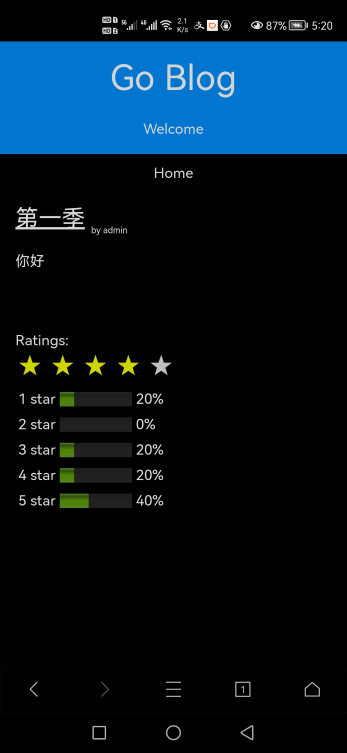
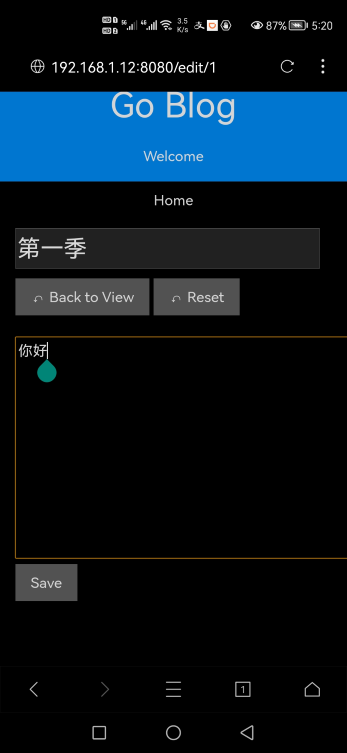
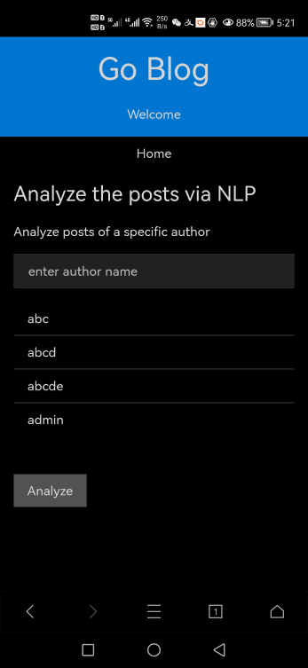

# goblog

A blog system used for sharing ideas and analyzing
these articles via AI algorithms.

## UI

view a post | edit a post | analysis
:----------:|:-----------:|:-------:
||

## functions

### work as a blog site

* read/write blogs
* signup/signin/logout
* vote with stars 1~5
* user ranks: bronze, silver, gold
* user admin

### work as code browsing platform

In the debug mode, programmers can browse underlying code on line.
It can help them to learn this system and make the debug life easier.

### work as AI analysis system

As a reader, the gold and silver user can
get AI analysis of article(s) on the blog.

The user can ask to analyze articles of an specific author
and the request will sent to data-analysis center.

this module is under developping now

## TO DO LIST

- [ ] machine learning code
- [x] basic test case via go
- [ ] pprof investigation
- [ ] fix bottleneck of the database create/update operation
- [ ] garbage collection performance
- [ ] other performance issue

## how to use

### Prerequisites

* mysql for storing blog posts
* redis for storing cache -- login sessions
* hzget/analysis for analyzing the data in the data center

You can change to others for corresponding service. Just only make very little code changes.

### Configuration

please refer to the config file config/config.json

### run the code from within the host

#### if prerequisites services are available

modify the config file and run the command ***go run .*** :

```bash
$ go build
$ ./goblog
PONG <nil>
Connected!

```

After that, visit the url via a web browser:

http://localhost:8080/

### run the code from within a container

#### if mysql and redis services are not available

The user can run containers of goblog, mysql, redis and analysis.

* run all containers with docker-compose.yaml:
  * docker-compose up -d goblog

* get goblog logs:

    docker-compose logs -f goblog

If all works well, you can visit http://localhost:8080

#### if mysql and redis services are available as containers

suppose mysql and redis are in the network goblog\_default,

run the goblog container with the following command:

```bash
docker run -dp 8080:8080 --name goblog-running -w /app --network goblog_default hzget/goblog:latest sh -c "/app/goblog"
```

if mysql and redis serivces are started up via the docker-compose.yml file,
the you can start the goblog container with the same file:

* docker-compose up -d goblog

## how to test

testcase is u

* automate [test case](./test/client), run with command ***go test***

* manually test via ***curl*** command line

