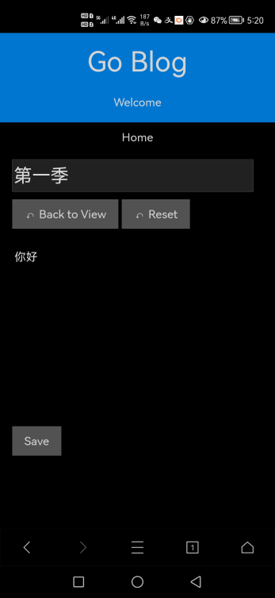

# goblog

A blog system used for sharing ideas and analyzing
these articles via AI algorithms.

## UI

view a post | edit a post | analysis
:----------:|:-----------:|:-------:
||

## functions

### work as a blog site

* read/write blogs
* signup/signin/logout
* vote with stars 1~5
* user ranks: bronze, silver, gold
* user admin

### work as code browsing platform

In the debug mode, programmers can browse underlying code on line.
It can help them to learn this system and make the debug life easier.

### work as AI analysis system

As a reader, the gold and silver user can
get AI analysis of article(s) on the blog.

The user can ask to analyze articles of an specific author
and the request will sent to data-analysis center.

this module is under developping now

## how to use

### Prerequisites

* mysql for storing blog posts
* redis for storing cache -- login sessions
* hzget/analysis for analyzing the data in the data center

You can change to others for corresponding service. Just only make very little code changes.

### Configuration

please refer to the config file config/config.json

### run the code from within the host

#### if prerequisites services are available

modify the config file (suppose open the flag: page.randomprefix) and run the command ***go run .*** :

```bash
$ go run .
/55e2e2fd-ae96-45b9-9249-6740416ebe18
PONG <nil>
Connected!

```

After that, visit the url via a web browser:

http://youripaddr:8080/55e2e2fd-ae96-45b9-9249-6740416ebe18/

### run the code from within a container

#### if mysql and redis services are not available

The user can run containers of goblog, mysql, redis and analysis.

* run all containers with docker-compose.yaml:
  * docker-compose up -d goblog

* get goblog logs:

    docker-compose logs -f goblog

If all works well, you can visit http://localhost:8080

#### if mysql and redis services are available as containers

suppose mysql and redis are in the network goblog\_default,

run the goblog container with the following command:

```bash
docker run -dp 8080:8080 --name goblog-running -w /app --network goblog_default hzget/goblog:latest sh -c "/app/goblog"
```

if mysql and redis serivces are started up via the docker-compose.yml file,
the you can start the goblog container with the same file:

* docker-compose up -d goblog

## how to test

### test via curl

```bash
# create a post
curl 127.0.0.1:8080/savejs -d '{"id":0, "title":"哦哈哟", "body":"骑上我心爱的小摩托，它永远不会堵车。"}'
# response
{
	"success": false,
	"message": "please log in first"
}
# login with user: admin
curl -d '{"username":"admin", "password":"admin"}' -c cookies.txt 127.0.0.1:8080/signin
# response
{
	"success": true,
	"message": "signin success"
}
# cookie is from http header and it contains login info
# cat cookies.txt 
# output:
# Netscape HTTP Cookie File
# https://curl.haxx.se/docs/http-cookies.html
# This file was generated by libcurl! Edit at your own risk.

127.0.0.1	FALSE	/	FALSE	1642166306	user	admin
127.0.0.1	FALSE	/	FALSE	1642166306	session_token	63451ff1-c832-4195-b830-90f1f99f0cd5

# create a new post with cookies in the request
curl 127.0.0.1:8080/savejs -b cookies.txt -d '{"id":0, "title":"哦哈哟", "body":"骑上我心爱的小摩托，它 永远不会堵车。"}'
# the "id" in the response is used for identifing the post
{
	"success": true,
	"message": "save success",
	"id": 22
}

# get the post
curl -b cookies.txt 127.0.0.1:8080/viewjs -d '{"id":22}'
{
	"success": true,
	"message": "",
	"id": 22,
	"title": "哦哈哟",
	"author": "admin",
	"date": "2022-01-14T12:18:42Z",
	"modified": "2022-01-14T12:18:42Z",
	"body": "骑上我心爱的小摩托，它永远不会堵车。",
	"postid": 0,
	"star1": 0,
	"star2": 0,
	"star3": 0,
	"star4": 0,
	"star5": 0
}
```
